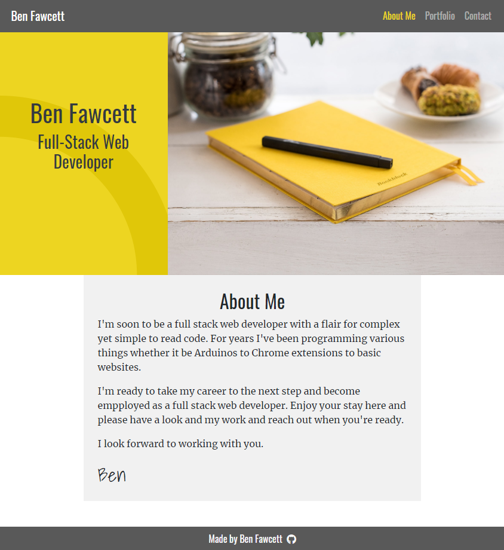
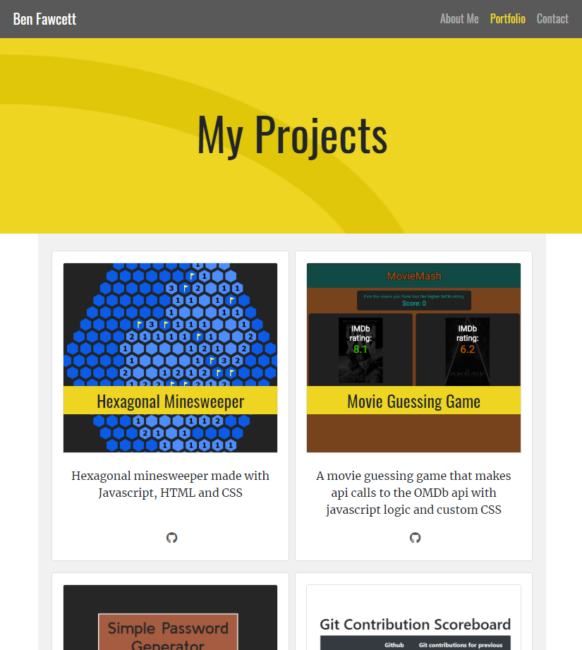
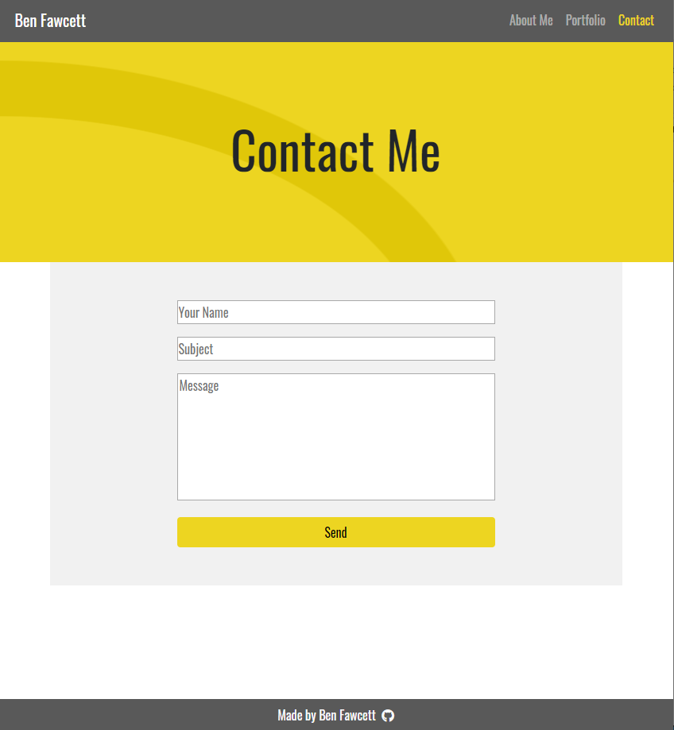

# My Portfolio

[View here](https://hexagonatron.github.io/Portfolio/)

This website was designed to act as a basis for my portfolio. It contains an index page with a little info about me, a portfolio page which lists some of my projects and a contact page to get in touch with me. The overall style of the website is mainly provided using Bootstrap classes with a few tweaks here and there. The website is also responsive to ensure that it looks consistent across all screen sizes.

## Screenshots

### Home Page

### Portfolio Page

### Contact Page

## Technologies Used
* HTML
* CSS
* Bootstrap

## Author

Ben Fawcett
